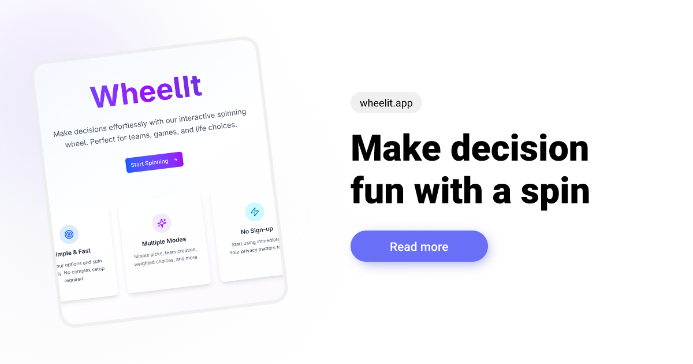

# 🎯 WheelIt - Interactive Decision Maker



A free, simple, and powerful web application for making random selections. Perfect for choosing restaurants, creating teams, picking names, or making any kind of decision!

**Live App**: [wheelit.app](https://wheelit.app)

## ✨ Features

### 🎲 Four Selection Modes

- **Simple Mode**: Pick one random item from your list
- **Teams Mode**: Automatically create balanced teams from your items
- **Weighted Mode**: Set custom probabilities for each item (e.g., A=40%, B=60%)
- **Multiple Mode**: Select several items at once without repetition

### 🎨 Interactive Spinning Wheel

- Beautiful animated roulette with smooth rotations
- Color-coded segments for easy visualization
- Realistic spinning physics with randomized results

### 💾 Data Management

- **Local Storage**: Your lists are saved automatically in your browser
- **Export/Import**: Save your configurations as JSON files
- **No Registration Required**: Completely free and anonymous

### 📱 User-Friendly Interface

- **3-Step Process**: Welcome → Setup → Spin
- **Responsive Design**: Works perfectly on mobile and desktop
- **Intuitive Controls**: Add, remove, and modify items easily

### 🔊 Audio & Haptic Feedback

- Spinning wheel sound effects
- UI interaction sounds
- Mobile haptic feedback support
- Customizable audio settings

### 📤 **Comprehensive Sharing & Export System**

- **Social Media Integration**: Share directly to Twitter, Facebook, WhatsApp, and Telegram
- **QR Code Generation**: Generate QR codes for easy mobile sharing
- **Native Web Share API**: Use device's native sharing on mobile devices
- **Multiple Export Formats**:
  - JSON (complete configuration and results data)
  - CSV (spreadsheet-compatible format)
  - TXT (plain text format)
  - PNG (image export of results)
- **Shareable URLs**: Generate links that automatically load wheel configurations
- **Custom Messages**: Add personalized messages to shares
- **Share History**: Export complete spin history and results

### ⚙️ Advanced Configuration

- Team constraints (keep certain items separate)
- Custom item weights and percentages
- Persistent configuration storage
- URL-based configuration sharing
- Real-time validation and feedback

## 🚀 How to Use

1. **Visit** [wheelit.app](https://wheelit.app)
2. **Choose** your selection mode (Simple, Teams, Weighted, or Multiple)
3. **Add** your items (names, restaurants, activities, etc.)
4. **Spin** the wheel and let fate decide!

## 🛠️ Technologies Used

- **Framework**: Next.js 14 with App Router
- **Styling**: Tailwind CSS
- **Icons**: Lucide React
- **Language**: TypeScript
- **Storage**: Browser localStorage (no backend required)

## 💻 Local Development

### Prerequisites

- Node.js 18+ installed on your system
- npm or yarn package manager

### Getting Started

```bash
# Clone the repository
git clone https://github.com/rvph10/wheelit.git

# Navigate to project directory
cd wheelit

# Install dependencies
npm install

# Start development server
npm run dev
```

Open [http://localhost:3000](http://localhost:3000) in your browser to see the application running locally.

### Available Scripts

```bash
# Development server
npm run dev

# Build for production
npm run build

# Start production server
npm start

# Lint code
npm run lint

# Type check
npm run type-check
```

## 📦 Build and Deploy

```bash
# Build for production
npm run build

# Start production server
npm start
```

The application can be deployed to any static hosting service like Vercel, Netlify, or GitHub Pages.

## 🎯 Use Cases

- **Team Building**: Create random teams for sports, games, or projects
- **Decision Making**: Choose restaurants, movies, or activities
- **Classroom Activities**: Pick students for presentations or group work
- **Event Planning**: Randomly assign tasks or roles
- **Gaming**: Create fair teams or select random challenges

## 🌟 Why WheelIt?

- ✅ **Completely Free** - No subscriptions or hidden fees
- ✅ **No Registration** - Start using immediately
- ✅ **Privacy First** - All data stays in your browser
- ✅ **Mobile Friendly** - Use anywhere, anytime
- ✅ **Multiple Modes** - Flexible for any selection need
- ✅ **Export/Import** - Share configurations with others

## 🎯 Team Constraints Feature

The team mode now supports advanced constraints to create more balanced and fair teams:

### How It Works

1. Go to **Setup** and select **Teams Mode**
2. Click **"Manage"** next to "Team Constraints"
3. Select pairs of items that should **not** be placed on the same team
4. The algorithm will automatically ensure these constraints are respected when creating teams

### Use Cases

- **Sports Teams**: Separate the strongest players across different teams
- **Work Groups**: Avoid putting team leads together
- **Study Groups**: Balance skill levels by separating experienced members
- **Event Planning**: Ensure diverse representation across teams

### Technical Implementation

- Smart constraint-aware team creation algorithm
- Fallback mechanisms for impossible constraint scenarios
- Preserved in shared URLs and exports
- Visual indicators in the results showing which constraints were applied

## 💖 Support the Project

If you find WheelIt useful and would like to support its development:

[](https://buymeacoffee.com/rvph)

Your support helps keep this project free and continuously improved!

## 📄 License

This project is open source and available under the [MIT License](LICENSE). You can do whatever you want with it, just keep the attribution!

## 🤝 Contributing

Contributions are welcome! Feel free to open issues or submit pull requests.

1. Fork the repository
2. Create a feature branch (`git checkout -b feature/amazing-feature`)
3. Commit your changes (`git commit -m 'Add some amazing feature'`)
4. Push to the branch (`git push origin feature/amazing-feature`)
5. Open a Pull Request

## 📞 Support

Having issues or suggestions? Please open an issue on GitHub or visit [wheelit.app](https://wheelit.app) to try the app.

---

**Created with ❤️ by [upintown.dev](https://upintown.dev)**
